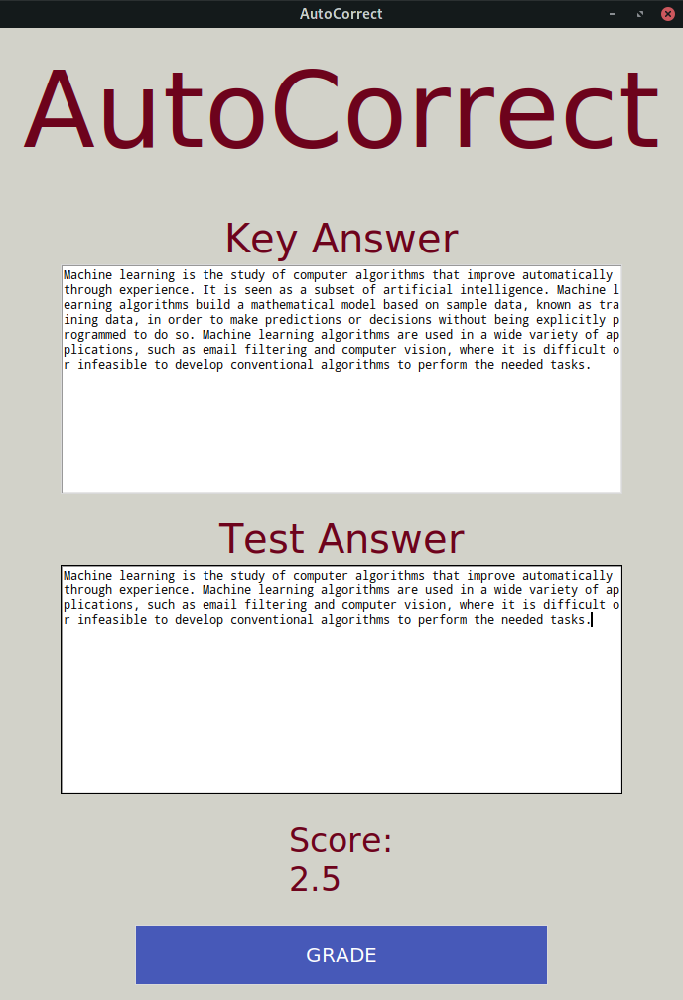

# AutoCorrect
A novel method of automatically grading descriptive answers, using Natural Language Processing.



## Too many papers!

Correction of papers is a strenuous and physically tiring task. It requires constant
concentration and a clear conscience and fair hand to mark answers and award a candidate
their deserved marks. During Examinations, over thousands of papers are sometimes
corrected, with some teachers putting in the effort to correct almost a hundred papers every
day. 

This ardent effort sometimes leads to mistakes creeping in, or a non-standardised
method of evaluation, wherein benefits may be given to a student, based on his scores in
previous answers. We need to find a way to not only reduce the pressure on teachers during
exam sessions but also speed up the process of correction.

## Why AutoCorrect?

The future lies in automation and computers aided with machine learning can solve this
issue quite comfortably. If answer script evaluation can be automated, it will not only lead to
a stricter and more standardised as well as a fair method of correction but will also lead to
lesser instances of mistakes, or any form of malpractice that is possible on the teacher’s
end. 

It will also help increase the rate of paper correction and lessen the burden teachers
have during the exam season. Although this method might not immediately replace a
teacher’s correction, it will certainly go a long way to digitize the entire process and
may soon be a mainstream application.

## How does it work?
The core of this application lies in Image Recognition and Natural Language Processing
(NLP). A database for every question paper is stored which contains each question’s model
answer, stored along with its comparison model which is a knowledge graph. 

This allows for retention of
concepts as well as the structure of the answer. A comparison is made by dividing the graph into sub-graphs, 
based on the position of leaf nodes and contextual embeddings are used to compare similarity. Finally, a check is
performed on the structural similarity to return the final score.

## How to run AutoCorrect?
1. Clone the repo
```bash
git clone https://github.com/aditeyabaral/autocorrect-ingenius-2020
```

2. Since the libraries have strict dependency rules, it is advisable to create a new environment.
```bash
cd autocorrect
pip3 install virtualenv
virtualenv autocorrect
source autocorrect/bin/activate
```

3. Install the dependencies
```bash
pip3 install -r requirements.txt
```

4. Install Java-8 for your distribution

5. Download `nltk` resources
```python
>>> import nltk
>>> nltk.download("punkt")
>>> nltk.download("stopwords")
```

6. Download the [fastText embedding models](https://drive.google.com/drive/folders/1-I1t2GGPYarctoIL7SvM3aJw2LbWphKo?usp=sharing) and place them in a folder named `ft_model` in the root directory.

7. Run the GUI script
```bash
python3 gui.py
```

## How to train personal fastText embeddings?
The script `embedding.py` contains the code to train custom embeddings. Additionally, the hyparameters can 
be tweaked in the script too. 
```Python
>>> import embedding
>>> model = createFastTextModel(document)
>>> model.save("filename.model")
```
Remember to save the model to the appropriate directory to load the model for evaluation. 

## Technology Stack
Python3 is used for all parts of the project. The specific libraries used are -
* Natural Language Processing
  * nltk
  * spaCy
  * gensim
  * Stanford coreNLP
* Knowledge Graphs
  * pandas
  * networkx
* Image Processing 
  * OpenCV
  * pytesseract
